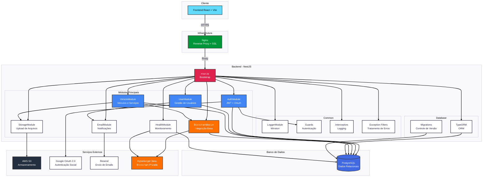

<h1 align="center">
  AutoLogger Service
</h1>

<h4 align="center">
  API REST para Gestão de Histórico Veicular com Blockchain Privada
</h4>

<p align="center">
  <a href="https://sonarcloud.io/summary/new_code?id=Pellegr1n1_autologger-services">
    
  </a>
  <a href="https://sonarcloud.io/summary/new_code?id=Pellegr1n1_autologger-services">
    
  </a>
  <a href="https://sonarcloud.io/summary/new_code?id=Pellegr1n1_autologger-services">
    
  </a>
  <a href="https://sonarcloud.io/summary/new_code?id=Pellegr1n1_autologger-services">
    
  </a>
</p>

<p align="center">
  <strong>Status:</strong> Em Produção | 
  <strong>Versão:</strong> 1.0.0 | 
  <strong>API:</strong> <a href="https://api.autologger.online/health">api.autologger.online</a>
</p>


---

## Sobre o Projeto

**AutoLogger Service** é uma API REST desenvolvida em **NestJS** que permite o gerenciamento completo de veículos e seus históricos de manutenção. O sistema utiliza **blockchain privada (Hyperledger Besu)** para garantir a integridade e imutabilidade dos registros de serviços, assegurando que os dados não sejam alterados após o registro.

### Contexto e Problema

Atualmente, o gerenciamento de histórico veicular enfrenta diversos desafios:
- **Perda de histórico de manutenção**: Dificuldade em manter registros imutáveis dos serviços realizados
- **Falta de integridade dos dados**: Possibilidade de alteração ou perda de registros históricos
- **Dados fragmentados**: Histórico espalhado em diferentes documentos e sistemas
- **Gerenciamento manual**: Processo trabalhoso para organizar e consultar histórico de múltiplos veículos

### Solução

O AutoLogger Service digitaliza e otimiza esse fluxo, oferecendo uma plataforma completa para gestão de histórico veicular com registro imutável via blockchain. A solução permite que:

- **Proprietários de Veículos** cadastrem e gerenciem manualmente o histórico completo de manutenções, serviços e despesas de seus veículos, com upload de comprovantes (notas fiscais, recibos, etc.)
- **Gestão Financeira** acompanhe e categorize gastos relacionados aos veículos através de relatórios detalhados, gráficos comparativos e exportação de dados em CSV, facilitando o planejamento financeiro
- **Compartilhamento Seguro** compartilhe o histórico veicular com compradores potenciais através de links públicos temporários ou QR codes, aumentando a transparência e confiança nas transações
- **Sistema Blockchain** garanta a imutabilidade e integridade dos registros através de hashes criptográficos registrados na blockchain privada Besu, assegurando que dados confirmados não possam ser alterados retroativamente
- **Valorização na Revenda** comprove o histórico de manutenção e cuidados com o veículo, agregando valor na revenda de veículos bem conservados

**Importante:** O sistema registra apenas as informações fornecidas manualmente pelo proprietário do veículo. Não há integração automática com oficinas ou sistemas de terceiros, e o sistema não valida a veracidade dos dados inseridos - apenas garante que, uma vez registrados na blockchain, esses dados não possam ser alterados.


---

## Principais Funcionalidades

### Autenticação e Usuários

- `Cadastro e Login` Registro com email/senha ou Google OAuth 2.0
- `Verificação de Email` Sistema de confirmação de conta
- `Recuperação de Senha` Reset de senha via email
- `Gerenciamento de Perfil` Edição de dados pessoais
- `Exclusão de Conta` Remoção segura de dados do usuário

### Gestão de Veículos

- `Cadastro Completo` Registro de veículos com todos os dados necessários
- `Upload de Fotos` Armazenamento de imagens dos veículos
- `Atualização e Exclusão` Edição e remoção de veículos
- `Marcação como Vendido` Controle de status de venda
- `Criptografia de Dados` Placas criptografadas no banco de dados
- `Estatísticas` Métricas e análises de veículos

### Serviços de Manutenção

- `Registro Detalhado` Cadastro completo de serviços realizados
- `Histórico Completo` Visualização de todos os serviços por veículo
- `Upload Múltiplo` Anexos de comprovantes e documentos
- `Informações Completas` Registro de custos, localização e técnico responsável
- `Filtros Avançados` Busca e filtragem de serviços
- `Cálculo de Custos` Total de gastos por veículo
- `Integração Blockchain` Registro imutável na blockchain

### Blockchain

- `Registro Imutável` Serviços registrados na blockchain privada
- `Verificação de Integridade` Validação de dados via hash criptográfico
- `Diagnóstico de Saúde` Monitoramento da rede blockchain
- `Hash Único` Geração de Keccak256 para cada registro
- `Status de Confirmação` Acompanhamento de transações

### Compartilhamento

- `Links Temporários` Geração de links de compartilhamento com token único
- `Expiração Configurável` Controle de tempo de validade dos links
- `Controle de Anexos` Opção de incluir/excluir anexos no compartilhamento
- `Consulta Pública` Visualização de veículos sem autenticação

---

## Tecnologias

### Backend

| Tecnologia | Versão | Descrição |
|------------|--------|-----------|
|  | 11.0.0 | Framework Node.js modular |
|  | 5.7.3 | Linguagem de programação |
|  | 20.x | Runtime JavaScript |

### Banco de Dados

| Tecnologia | Versão | Descrição |
|------------|--------|-----------|
|  | 15 | Banco de dados relacional |
|  | 0.3.17 | ORM para TypeScript |

### Blockchain

| Tecnologia | Versão | Descrição |
|------------|--------|-----------|
|  | 24.1.2 | Cliente Ethereum para blockchain privada |
|  | 6.8.1 | Biblioteca para interação com blockchain |
|  | 0.8.19 | Linguagem para smart contracts |
|  | 5.11.5 | Framework para desenvolvimento de contratos |

### Autenticação e Segurança

| Tecnologia | Versão | Descrição |
|------------|--------|-----------|
|  | 9.0.2 | Tokens de autenticação |
|  | 0.7.0 | Middleware de autenticação |
|  | 2.4.3 | Hash de senhas |
|  | 2.0.0 | Autenticação social |

### Armazenamento e Email

| Tecnologia | Versão | Descrição |
|------------|--------|-----------|
|  | SDK 3.x | Storage de arquivos |
|  | 1.4.5 | Upload de arquivos |
|  | 6.5.2 | Envio de emails |

### DevOps & Ferramentas

| Ferramenta | Descrição |
|------------|-----------|
|  | Containerização |
|  | Testes automatizados |
|  | Documentação de API |
|  | Sistema de logging |
|  | Linter de código |

---

## Arquitetura

### Visão Geral da Arquitetura

O AutoLogger Service segue uma **arquitetura modular** baseada em NestJS, organizada em módulos independentes que se comunicam através de injeção de dependência. A aplicação utiliza TypeORM para acesso ao banco de dados PostgreSQL e integra-se com serviços externos como AWS S3, Google OAuth e Hyperledger Besu para blockchain.

### Diagrama de Arquitetura (Mermaid)

O diagrama abaixo ilustra a arquitetura completa do backend, mostrando os módulos principais, suas dependências e integrações com serviços externos:



### Diagramas C4 (Arquitetura)

Os diagramas C4 fornecem diferentes níveis de detalhamento da arquitetura do sistema:

| Nível | Descrição | Diagrama |
|-------|-----------|----------|
| **C4 Level 1** | Contexto do Sistema - Visão geral e atores externos | [Ver diagrama](./docs/c4_architecture/c4_level1.png) |
| **C4 Level 2** | Container - Componentes principais | [Ver diagrama](./docs/c4_architecture/c4_level2.png) |
| **C4 Level 3** | Componente - Estrutura interna | [Ver diagrama](./docs/c4_architecture/c4_level3.png) |
| **C4 Level 4** | Código - Classes e relações | [Ver diagrama](./docs/c4_architecture/c4_level4.png) |

### Estrutura de Pastas

```
autologger-service/
├── src/                         # Código fonte
│   ├── common/                  # Código compartilhado
│   │   ├── decorators/          # Decorators customizados
│   │   ├── interceptors/        # Interceptors (logging, etc)
│   │   ├── guards/              # Guards de autenticação
│   │   ├── filters/             # Exception filters
│   │   └── logger/              # Módulo de logging
│   ├── database/                # Configuração do banco
│   │   ├── migrations/          # Migrações TypeORM
│   │   └── data-source.ts       # Configuração TypeORM
│   ├── modules/                 # Módulos da aplicação
│   │   ├── auth/                # Autenticação (JWT, OAuth)
│   │   ├── user/                # Gestão de usuários
│   │   ├── vehicle/             # Gestão de veículos e serviços
│   │   ├── blockchain/          # Integração blockchain
│   │   ├── email/               # Envio de emails
│   │   ├── storage/             # Armazenamento de arquivos
│   │   ├── health/              # Health checks
│   │   ├── email-verification/  # Verificação de email
│   │   └── password-reset/      # Recuperação de senha
│   ├── app.module.ts            # Módulo raiz
│   └── main.ts                  # Ponto de entrada
│
├── 📁 infrastructure/           # Infraestrutura
│   └── blockchain/              # Configuração Besu
│       └── besu-network/        # Rede blockchain privada
│
├── 📁 test/                     # Testes end-to-end
├── 📁 docs/                     # Documentação técnica
├── 📁 coverage/                 # Relatórios de cobertura
├── 📄 Dockerfile                # Configuração Docker
├── 📄 docker-compose.yml        # Orquestração de containers
├── 📄 package.json              # Dependências
└── 📄 tsconfig.json             # Configuração TypeScript
```

### Banco de Dados (PostgreSQL)

**Principais Entidades:**

- `users` - Tabela base de usuários
- `vehicles` - Veículos cadastrados
- `vehicle_services` - Serviços de manutenção
- `vehicle_attachments` - Anexos de serviços
- `vehicle_shares` - Links de compartilhamento
- `email_verifications` - Tokens de verificação
- `password_resets` - Tokens de recuperação

### Módulos Principais

- **AuthModule**: Autenticação JWT e Google OAuth 2.0
- **UserModule**: Gestão de usuários e perfis
- **VehicleModule**: CRUD de veículos e serviços
- **BlockchainModule**: Integração com Hyperledger Besu
- **EmailModule**: Envio de notificações e emails
- **StorageModule**: Upload e gerenciamento de arquivos
- **HealthModule**: Health checks e monitoramento

---

## Como Executar

### Pré-requisitos

Antes de começar, você vai precisar ter instalado em sua máquina:
- [Git](https://git-scm.com)
- [Node.js](https://nodejs.org/en/) (v20.x ou superior)
- [Docker](https://www.docker.com/) e [Docker Compose](https://docs.docker.com/compose/)
- [PostgreSQL](https://www.postgresql.org/) (caso não use Docker)
- [Hyperledger Besu](https://besu.hyperledger.org/)

### Rodando a Aplicação (Modo Desenvolvimento)

```bash
# Clone este repositório
$ git clone https://github.com/user/autologger.git

# Acesse a pasta do projeto
$ cd autologger/autologger-service

# Instale as dependências
$ npm install

# Copie o arquivo de variáveis de ambiente
$ cp .env.example .env

# Edite o arquivo .env com suas credenciais
$ nano .env  # ou use seu editor favorito

# Execute as migrações do banco de dados
$ npm run typeorm:migration:run

# Inicie a aplicação em modo desenvolvimento
$ npm run start:dev

# A aplicação estará rodando em:
# API: http://localhost:3001
# Swagger: http://localhost:3001/api
```

### Rodando com Docker

```bash
# Suba os containers com Docker Compose
$ docker-compose up -d

# A aplicação estará rodando em:
# API: http://localhost:3001
# Swagger: http://localhost:3001/api
```

### Configuração das Variáveis de Ambiente

Crie um arquivo `.env` na raiz do projeto com as seguintes variáveis:

```env
# Application
NODE_ENV=development
PORT=3001
DOMAIN=localhost
PROTOCOL=http

# Database
DB_HOST=localhost
DB_PORT=5432
DB_NAME=autologger
DB_USERNAME=postgres
DB_PASSWORD=sua_senha_aqui
DB_SSL=false

# JWT
JWT_SECRET=seu_jwt_secret_aqui
JWT_EXPIRES_IN=7d

# Google OAuth
GOOGLE_CLIENT_ID=seu_google_client_id
GOOGLE_CLIENT_SECRET=seu_google_secret
GOOGLE_CALLBACK_URL=http://localhost:3001/auth/google/callback

# Blockchain (Besu)
BESU_RPC_URL=http://localhost:8545
BESU_PRIVATE_KEY=sua_chave_privada
BESU_CONTRACT_ADDRESS=endereco_do_contrato

# AWS S3 (Opcional)
STORAGE_TYPE=local  # ou 's3'
AWS_REGION=us-east-1
AWS_ACCESS_KEY_ID=sua_aws_key
AWS_SECRET_ACCESS_KEY=sua_aws_secret
AWS_S3_BUCKET_NAME=seu_bucket

# Email
EMAIL_FROM=AutoLogger <noreply@autologger.online>
EMAIL_HOST=smtp.gmail.com
EMAIL_PORT=587
EMAIL_USER=seu_email
EMAIL_PASSWORD=sua_senha

# Resend (Alternativa)
RESEND_API_KEY=sua_chave_resend

# CORS
CORS_ORIGINS=http://localhost:5173,http://localhost:3000
```

### Scripts Disponíveis

```bash
# Desenvolvimento
npm run start:dev          # Inicia em modo watch
npm run start:debug        # Inicia em modo debug
npm run start:prod         # Inicia em produção

# Banco de Dados
npm run typeorm:migration:generate  # Gera nova migração
npm run typeorm:migration:run       # Executa migrações
npm run typeorm:migration:revert    # Reverte última migração

# Blockchain
npm run truffle:compile    # Compila smart contracts
npm run truffle:migrate    # Faz deploy dos contratos
npm run blockchain:start   # Inicia rede Besu
npm run blockchain:stop    # Para rede Besu

# Testes
npm test                    # Executa todos os testes
npm run test:watch          # Testes em modo watch
npm run test:cov            # Cobertura de testes
npm run test:e2e            # Testes end-to-end

# Qualidade
npm run lint                # Verifica código com ESLint
npm run format              # Formata código com Prettier
```

---

## Testes

### Executar Testes

```bash
# Todos os testes
npm test

# Testes em modo watch
npm run test:watch

# Cobertura de testes
npm run test:cov

# Testes end-to-end
npm run test:e2e
```

### Estrutura de Testes

```
test/
├── e2e/                    # Testes end-to-end
│   └── *.e2e-spec.ts
└── jest-e2e.json           # Configuração Jest E2E

src/
└── **/*.spec.ts            # Testes unitários
```

---

## Segurança

### Implementações de Segurança

- **HTTPS/SSL** com certificados configuráveis
- **JWT** para autenticação stateless (armazenados em cookies httpOnly)
- **Google OAuth 2.0** para autenticação social
- **Bcrypt** para hash de senhas (salt rounds: 10)
- **Criptografia de Dados** - Placas de veículos criptografadas
- **Input Validation** - Validação com class-validator
- **CORS** configurado adequadamente
- **Helmet.js** para headers de segurança HTTP (via NestJS)
- **SQL Injection** prevenido via TypeORM
- **XSS Protection** via sanitização de inputs
- **Rate Limiting** configurável
- **Variáveis de Ambiente** protegidas (.env não versionado)

### Conformidade

- **LGPD** - Lei Geral de Proteção de Dados
- **OAuth 2.0** - Padrão de autorização
- **OWASP Top 10** - Principais vulnerabilidades mitigadas

---

## Documentação

### API Documentation

A documentação completa da API está disponível via Swagger:

- **Local**: [http://localhost:3001/api](http://localhost:3001/api)
- **Produção**: [https://api.autologger.online/api](https://api.autologger.online/api)

### Endpoints Principais

#### Autenticação
- `POST /auth/register` - Registro de usuário
- `POST /auth/login` - Login com email/senha
- `GET /auth/google` - Login com Google OAuth
- `POST /auth/logout` - Logout
- `POST /auth/refresh` - Renovar token

#### Usuários
- `GET /users/profile` - Obter perfil
- `PUT /users/profile` - Atualizar perfil
- `DELETE /users/profile` - Excluir conta

#### Veículos
- `GET /vehicles` - Listar veículos
- `POST /vehicles` - Criar veículo
- `GET /vehicles/:id` - Obter veículo
- `PUT /vehicles/:id` - Atualizar veículo
- `DELETE /vehicles/:id` - Excluir veículo

#### Serviços
- `GET /vehicle-services` - Listar serviços
- `POST /vehicle-services` - Criar serviço
- `GET /vehicle-services/:id` - Obter serviço
- `PUT /vehicle-services/:id` - Atualizar serviço
- `DELETE /vehicle-services/:id` - Excluir serviço

#### Blockchain
- `GET /blockchain/health` - Status da rede
- `GET /blockchain/diagnosis` - Diagnóstico completo
- `POST /blockchain/verify` - Verificar hash

#### Compartilhamento
- `POST /vehicles/:id/share` - Criar link de compartilhamento
- `GET /vehicles/public/:token` - Acessar veículo compartilhado

---

## Deploy

### Ambiente de Produção

- **Hospedagem**: AWS
- **Containerização**: Docker + Docker Compose
- **Proxy**: Nginx com SSL/HTTPS
- **Banco de Dados**: PostgreSQL 15
- **Blockchain**: Hyperledger Besu (privada)
- **Storage**: AWS S3 (Amazon Simple Storage Service)

### Health Check

Acesse o endpoint de health check:
- **Local**: [http://localhost:3001/health](http://localhost:3001/health)
- **Produção**: [https://api.autologger.online/health](https://api.autologger.online/health)


